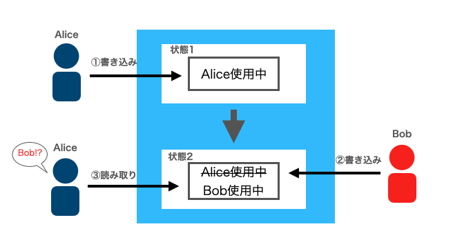

# レースコンディション

概要レースコンディションとは、複数のプロセスやスレッドから同一のリソースへ同時にアクセスした際に、予期せぬ処理結果が生じる問題です。

例えば、データベースにおいてトランザクションがレコードを読み取り、値の更新を行う際、その更新処理が終わる前に別のトランザクションが同じレコードを読み取り、値の更新を行った場合、最終的なレコードの値が想定とは異なる状態に更新されてしまうといった問題があります。

GraphQLにおいても、対策がされていない場合、QueryやMutationのリクエストを同時に送信された場合などに、レースコンディションの問題が発生する危険性があります。

特にGraphQLにおいては、仕様上1つのリクエスト中で複数のMutationを発行した場合は順序が保証されていますが、複数のリクエストを同時に送信した場合の順序は保証されていないため、サーバ側の実装次第ではレースコンディションの影響を受ける危険性があります。

## 影響

通常のレースコンディションと同様に、予期せぬ処理結果が生じます。例えば、以下のようなものです。

・データの不整合が発生する

・アクセス制限が回避される

など

実際に、以下のような事例が報告されています。

[https://hackerone.com/reports/488985](https://hackerone.com/reports/488985)

テスト用アカウントのクレデンシャルを取得するmutaitionリクエストを複数送信することにより、本来取得できないはずのアカウントのクレデンシャルを取得可能であった。

## 検証方法

設計上、競合状態が発生した際の影響が考えられる箇所についてQueryやMutationリクエストをミリ秒単位で同時に複数送信した場合に処理結果に不整合が発生しないか確認をします。具体的な方法としては、BurpSuiteのIntruderのようなローカルプロキシツールの機能の利用が挙げられます。

また、ホワイトボックステストも有効です。データベースやファイルなどの共有資源へアクセスする処理では問題が起きやすいため、排他制御が適切に行われているか重点的に確認しましょう。

## 対策

複数のプロセスやスレッドから同一リソースへのアクセスが必要な場合、リソースのチェックから更新までの一連の処理が完了するまで、他のプロセスからアクセスできないように排他制御を実装することが推奨されます。

しかしながら、排他制御の実装によっては、サイトのパフォーマンスにも影響を及ぼす可能性があるため、レースコンディション対策ではより一層注意してください。